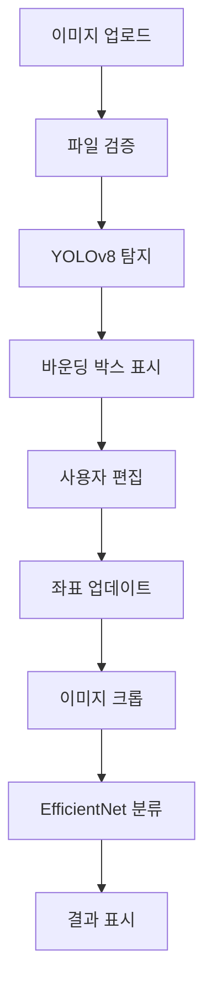

# NEST Project 구조 브리핑

## 📋 프로젝트 개요
**NEST 곤충생태지도**는 AI 기반 곤충 탐지·분류·위험도 평가 시스템으로, 시민 참여형 생태 데이터 수집 플랫폼입니다.

## 🏗️ 전체 아키텍처

```
NEST_Project/
├── app.py                 # Flask 메인 애플리케이션
├── utils/                 # AI 모델 유틸리티
│   ├── detector.py        # 곤충 탐지 (YOLOv8)
│   ├── classifier.py      # 곤충 분류 (EfficientNet-B4)
│   └── models/            # AI 모델 가중치
│       └── yolov8n.pt     # YOLO 기본 모델
├── templates/             # 웹 템플릿
│   └── index.html         # 메인 인터페이스
├── uploads/               # 업로드된 이미지
├── results/               # 탐지 결과 이미지
├── crops/                 # 크롭된 곤충 이미지
├── statics/               # 정적 파일
└── docs/                  # 문서 및 이미지
```

## 🔧 핵심 컴포넌트

### 1. Flask 웹 애플리케이션 (app.py)
- **역할**: 웹 서버 및 API 엔드포인트 제공
- **주요 기능**:
  - 이미지 업로드 및 검증
  - 곤충 탐지 파이프라인 실행
  - 인터랙티브 바운딩 박스 조정
  - 곤충 분류 수행
  - 세션 관리

#### 주요 라우트:
- `GET/POST /`: 메인 페이지 (업로드 및 결과 표시)
- `POST /update_bboxes`: 바운딩 박스 업데이트
- `POST /classify`: 곤충 분류 수행
- `GET /uploads/<filename>`: 업로드 이미지 서빙
- `GET /results/<filename>`: 탐지 결과 이미지 서빙
- `GET/POST /reset`: 세션 초기화

### 2. 곤충 탐지 모듈 (utils/detector.py)
- **AI 모델**: YOLOv8 (Ultralytics)
- **기능**:
  - 이미지에서 곤충 객체 탐지
  - 바운딩 박스 생성 및 시각화
  - 신뢰도 기반 필터링
  - 적응적 박스 크기 조정

#### 핵심 클래스: `InsectDetector`
```python
def detect(image_path, save_path=None, use_tta=False)
def crop_detections(image_path, detections, output_dir)
```

### 3. 곤충 분류 모듈 (utils/classifier.py)
- **AI 모델**: EfficientNet-B4 (PyTorch)
- **기능**:
  - 탐지된 곤충 이미지 분류
  - Top-K 결과 반환
  - 배치 처리 지원

#### 핵심 클래스: `InsectClassifier`
```python
def classify(image_path, top_k=5)
def classify_detections(image_path, detections, crop_dir=None)
```

### 4. 웹 인터페이스 (templates/index.html)
- **프레임워크**: HTML5 + CSS3 + Vanilla JavaScript
- **특징**:
  - 반응형 디자인
  - 5단계 프로세스 시각화
  - 인터랙티브 바운딩 박스 편집
  - 드래그 앤 드롭 업로드

## 🔄 워크플로우

### 1단계: 이미지 업로드
```
사용자 이미지 업로드 → 파일 검증 → 안전한 저장
```

### 2단계: 곤충 탐지
```
YOLOv8 모델 → 바운딩 박스 생성 → 결과 시각화
```

### 3단계: 바운딩 박스 조정 (인터랙티브)
```
사용자 편집 → 실시간 업데이트 → 좌표 저장
```

### 4단계: 곤충 분류
```
이미지 크롭 → EfficientNet-B4 → 분류 결과 반환
```

### 5단계: 결과 표시
```
분류 결과 → 신뢰도 표시 → 상세 정보 제공
```

## 🛠️ 기술 스택

### Backend
- **Flask**: 웹 프레임워크
- **PyTorch**: 딥러닝 프레임워크
- **Ultralytics YOLOv8**: 객체 탐지
- **EfficientNet**: 이미지 분류
- **OpenCV**: 이미지 처리
- **PIL**: 이미지 조작

### Frontend
- **HTML5/CSS3**: 마크업 및 스타일링
- **Vanilla JavaScript**: 인터랙티브 기능
- **Canvas API**: 바운딩 박스 편집

### AI Models
- **YOLOv8n**: 실시간 곤충 탐지
- **EfficientNet-B4**: 고정밀 곤충 분류

## 🎯 주요 기능

### 1. 지능형 이미지 처리
- 자동 파일 형식 감지 및 변환
- 이미지 크기 적응적 처리
- 메모리 효율적 로딩

### 2. 인터랙티브 바운딩 박스
- 드래그로 위치 조정
- 모서리 드래그로 크기 조정
- 실시간 좌표 업데이트
- 바운딩 박스 추가/삭제

### 3. 세션 관리
- 탐지 결과 임시 저장
- 단계별 진행 상태 추적
- 사용자 편집 내용 보존

### 4. 적응적 UI
- 이미지 크기에 따른 스케일링
- 반응형 레이아웃
- 진행 단계 시각화

## 📊 데이터 플로우



## 🔒 보안 기능

### 파일 업로드 보안
- 파일 확장자 검증
- 실제 이미지 형식 확인
- 파일 크기 제한 (16MB)
- 안전한 파일명 생성

### 세션 보안
- Flask 세션 암호화
- CSRF 보호 (기본 제공)
- 파일 경로 검증

## 🚀 성능 최적화

### AI 모델 최적화
- 싱글톤 패턴으로 모델 로딩
- GPU 자동 감지 및 활용
- 배치 처리 지원

### 웹 성능
- 이미지 지연 로딩
- 적응적 이미지 크기 조정
- 클라이언트 사이드 캐싱

## 🔧 설정 및 확장성

### 모델 교체 가능성
- 탐지 모델: YOLOv8 → 다른 YOLO 버전
- 분류 모델: EfficientNet → ResNet, Vision Transformer 등

### 클래스 확장
- 곤충 종류 추가 가능
- 동적 클래스 로딩 지원

## 📝 개발 고려사항

### 현재 제한사항
1. 분류 모델 가중치 파일 누락
2. 클래스 이름 매핑 정보 부족
3. 위험도 평가 기능 미구현
4. 정보 제공 단계 미완성

### 개선 방향
1. 실제 곤충 분류 모델 훈련 및 적용
2. 데이터베이스 연동으로 결과 저장
3. 위험도 평가 알고리즘 구현
4. 곤충 정보 데이터베이스 구축
5. 사용자 인증 및 권한 관리

## 🎯 결론

NEST Project는 AI 기반 곤충 탐지 및 분류를 위한 완성도 높은 웹 애플리케이션입니다. 
- **강점**: 직관적인 UI, 인터랙티브 편집 기능, 모듈화된 구조
- **활용**: 생태 연구, 교육용 도구, 시민 과학 프로젝트
- **확장성**: AI 모델 교체 및 기능 추가 용이

현재 프로토타입 단계이지만, 실제 운영을 위해서는 분류 모델 훈련, 데이터베이스 연동, 추가 기능 구현이 필요합니다.