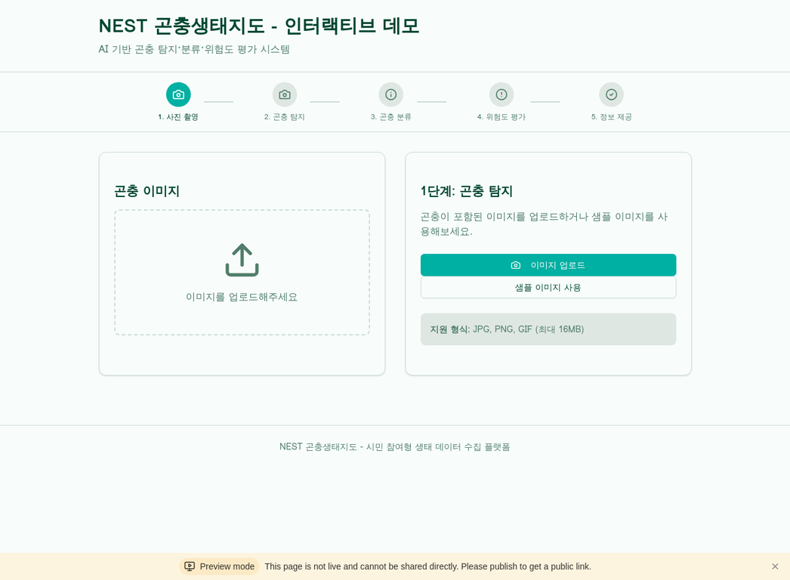
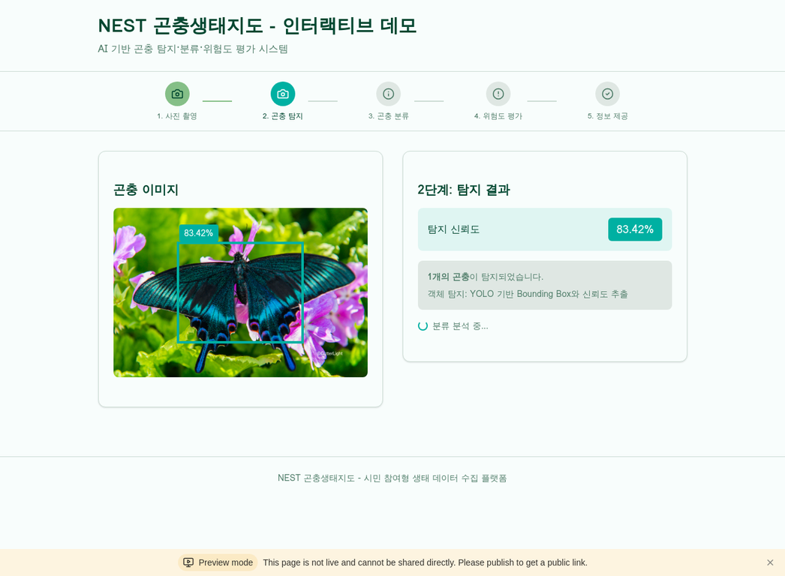
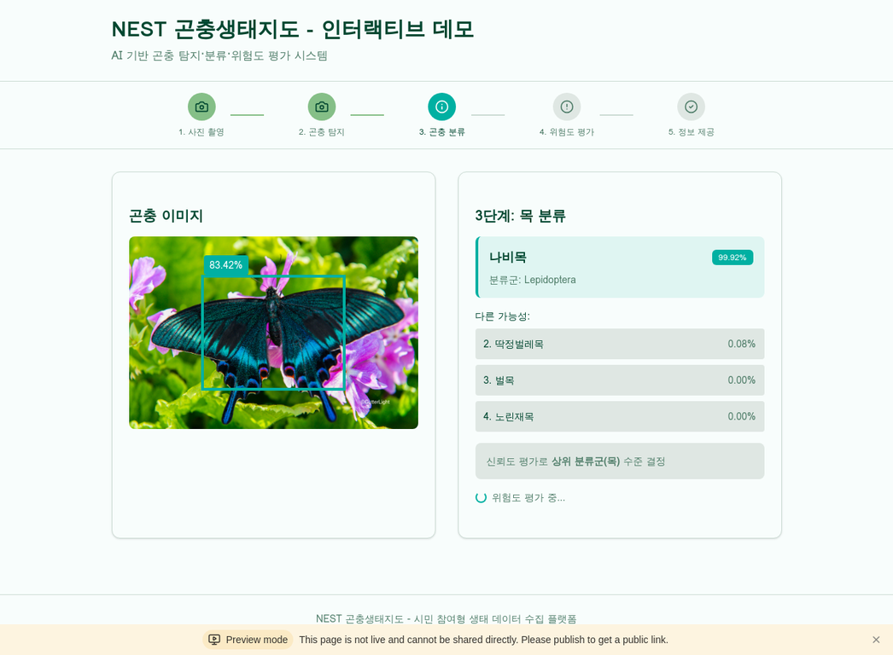
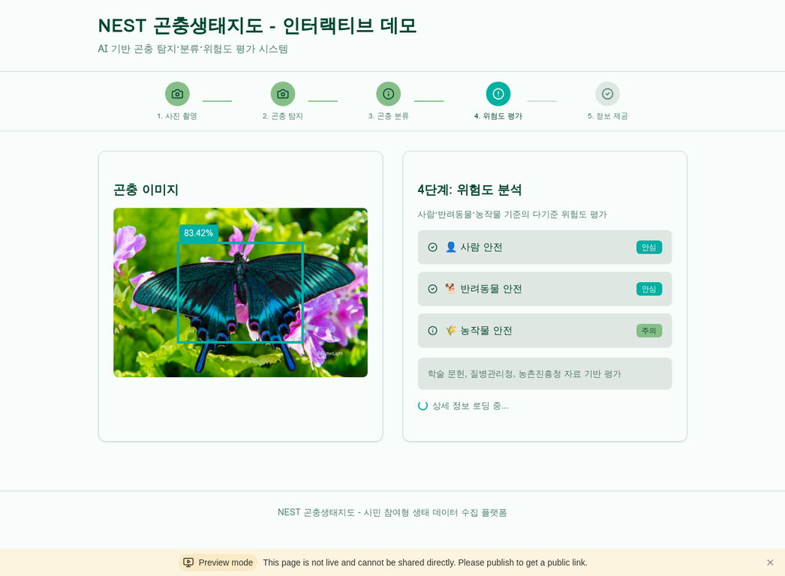
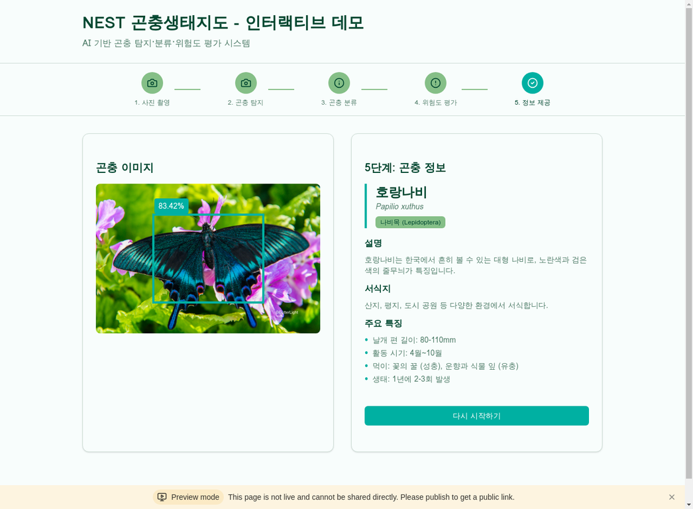

# 🐛 NEST - National Ecology Sensing Tracking for Insects

AI 기반 곤충 탐지 및 분류 시스템 개발 프로젝트입니다.

서울시에서 주최하는 2025 새싹 해커톤 예선 참가 자료 레포지토리입니다.


## 📋 현재 구현 단계

### ✅ 완료된 작업
- **저작도구 구현 완료**: 탐지 및 분류 모델 학습을 위한 데이터 라벨링 도구
- **어드민 페이지 구성**: 데이터 관리 및 모니터링 시스템
- **기본 웹 인터페이스**: 파일 업로드 및 결과 확인 UI
- **보안 시스템**: IP 화이트리스트 및 인증 시스템

### 🔄 진행 중인 작업
- **탐지 모델 학습**: YOLOv8 기반 곤충 탐지 모델 훈련
- **분류 모델 학습**: EfficientNet 기반 곤충 목(目) 분류 모델 훈련

### 📅 향후 계획
- **서비스 단계 구현** (모델 학습 완료 후)
  - 실시간 탐지 및 분류 API 개발
  - 성능 최적화 및 배포
- **곤충 종 정보 시스템**
  - 곤충 종명 데이터베이스 구축
  - 생태 정보, 독성 정보 등 상세 정보 제공
  - 분류 결과와 연동된 종 정보 조회 기능
- **메타데이터 관리 시스템**
  - 업로드 이미지 메타데이터 자동 추출 및 저장
  - 촬영 시간, GPS 위치 정보 수집
  - 사용자별 업로드 이력 관리
  - 분류 결과와 연동된 통합 데이터 저장
- **모바일 최적화**
  - 핸드폰 카메라 연동 기능
  - 실시간 위치 기반 서비스
  - 사용자 친화적 모바일 UI/UX

## 🛠️ 기술 스택

### Backend
- **Framework**: Flask (Python)
- **Database**: Supabase (PostgreSQL)
- **AI/ML**: PyTorch, YOLOv8, EfficientNet
- **Image Processing**: OpenCV, PIL

### Frontend
- **HTML/CSS/JavaScript**: 반응형 웹 디자인
- **UI Framework**: 사용자 친화 모던 디자인
- **File Upload**: 드래그앤드롭 인터페이스

### Infrastructure
- **Authentication**: Supabase Auth
- **Storage**: 로컬 파일 시스템
- **Security**: IP 화이트리스트, 악성 패턴 감지

## 📸 시스템 데모

### 1단계: 이미지 업로드


### 2단계: 곤충 탐지


### 3단계: 목 분류


### 4단계: 위험도 평가


### 5단계: 종 정보 제공


## ✨ 주요 기능

### 🎯 **2단계 AI 파이프라인**
1. **곤충 탐지**: YOLOv8 기반 이미지에서 곤충 자동 탐지 (TTA 제거로 속도 향상)
2. **목 분류**: EfficientNet 기반 곤충 목(目) 분류 (TTA 적용으로 정확도 향상)

### 🔐 **보안 시스템**
- IP 화이트리스트 기반 접근 제어
- 악성 패턴 자동 감지 및 차단
- 사용자 인증 시스템

### 🎨 **사용자 인터페이스**
- 토스 스타일 모던 디자인
- 드래그앤드롭 파일 업로드
- 반응형 웹 디자인

## 🚀 빠른 시작

### 1. 환경 설정
```bash
cd insect-detection-demo2
pip install -r requirements.txt
```

### 2. 환경 변수 설정
```bash
cp .env.example .env
# .env 파일을 편집하여 Supabase 설정 추가
```

### 3. 실행
```bash
cd src
python main.py
```

### 4. 접속
```
http://localhost:8000
```

## 📁 프로젝트 구조

```
insect-detection-demo2/
├── src/                    # 소스 코드
│   ├── main.py            # 메인 Flask 서버
│   ├── detector.py        # 곤충 탐지 모듈
│   ├── order_classifier.py # 목 분류 모듈
│   ├── auth.py            # 인증 시스템
│   ├── utils.py           # 유틸리티 함수
│   └── ip_*.py            # 보안 모듈
├── templates/             # HTML 템플릿
│   ├── index.html         # 메인 페이지
│   └── login.html         # 로그인 페이지
├── static/                # 정적 파일
│   ├── style.css          # 스타일시트
│   └── script.js          # JavaScript
├── uploads/               # 업로드 폴더
├── results/               # 결과 폴더
└── requirements.txt       # 의존성 패키지
```

## 🔧 모델 설정

### 탐지 모델
- **경로**: `runs_insect_new/augmented_train/weights/best.pt`
- **폴백**: YOLOv8n (모델 파일이 없는 경우)
- **TTA**: 비활성화 (속도 우선)

### 분류 모델
- **경로**: `best_detected_order_classifier_224.pth`
- **클래스**: 24개 곤충 목
- **TTA**: 활성화 (정확도 우선)

## 🛡️ 보안 기능

### IP 화이트리스트
- `whitelist.json`에서 허용 IP 관리
- 사설 IP 대역 기본 허용
- 동적 IP 추가/제거 가능

### 악성 패턴 감지
- SQL 인젝션, XSS 공격 차단
- 디렉토리 순회 공격 방지
- 비정상적인 요청 패턴 감지

## 📊 API 엔드포인트

### 핵심 API
- `POST /api/detect` - 곤충 탐지
- `POST /api/classify` - 목 분류
- `GET /api/health` - 헬스 체크

### 인증 API
- `POST /login` - 로그인
- `GET /logout` - 로그아웃

## 🎯 성능 최적화

### 탐지 모델
- ❌ TTA 제거
- ⚡ 단일 추론으로 빠른 처리
- 🎯 신뢰도 임계값: 70%

### 분류 모델 (정확도 우선)
- ✅ TTA 적용 (4가지 변환)
- 🔄 원본, 수평뒤집기, 회전, 스케일
- 📊 예측 결과 평균으로 정확도 향상

## 🚀 배포

### 로컬 개발
```bash
python src/main.py
```

### 프로덕션 (Gunicorn)
```bash
gunicorn -w 4 -b 0.0.0.0:8000 src.main:app
```

## 🎯 프로젝트 목표

국가 생태계 곤충 모니터링을 위한 AI 기반 자동 탐지 및 분류 시스템 구축

### 핵심 가치
- **정확성**: 고정밀 곤충 탐지 및 분류
- **효율성**: 대량 데이터 자동 처리
- **확장성**: 다양한 곤충 종 지원
- **접근성**: 사용자 친화적 인터페이스

## 📝 라이선스 및 저작권

⚠️ **중요 공지** ⚠️

이 프로젝트는 **2025 새싹 해커톤 참가 전용**으로 제작되었습니다.

### 🚫 금지 사항
- ❌ 무단 포크(Fork) 및 클론(Clone)
- ❌ 코드 복사 및 재사용
- ❌ 상업적 이용
- ❌ 재배포 및 수정 배포
- ❌ 아이디어 및 구조 도용

### ⚖️ 법적 보호
- 모든 코드는 저작권법에 의해 보호됩니다
- 무단 사용 시 법적 조치를 취할 수 있습니다

**라이선스**: All Rights Reserved
**문의**: 저작권 관련 문의는 이슈로 등록해 주세요